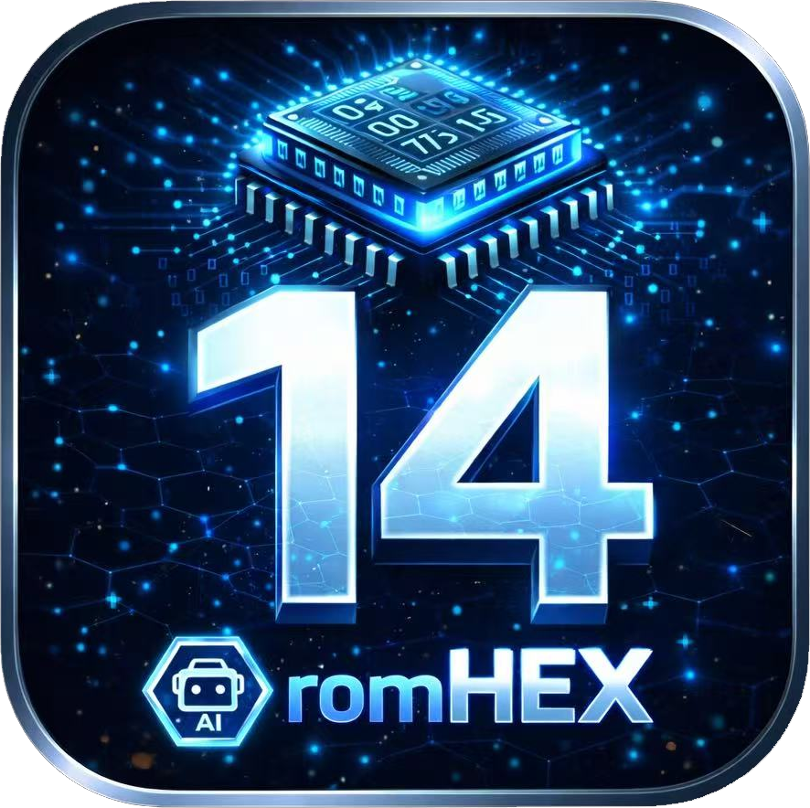

<p align="center">
  
</p>

<h1 align="center">romHEX 14 社区版</h1>

<p align="center">
  <strong>专业ECU标定十六进制编辑器</strong><br>
  开源、跨平台桌面应用程序，面向汽车标定工程师
</p>

<p align="center">
  <a href="./README.md">English</a> | <a href="./README_zh.md">中文</a>
</p>

<p align="center">
  
  
  
  
  
  
</p>

<p align="center">
  <i>专业ECU调校软件，支持A2L/HEX/OLS格式，集成AI工具，跨平台运行。</i>
</p>

<p align="center">
  <a href="https://gitee.com/ctabuyo/romHEX14-community/releases"><strong>下载最新版本</strong></a>  ·  
  <a href="https://github.com/ctabuyo/romHEX14-community">GitHub</a>
</p>

---

## 功能特性

### A2L、HEX与OLS引擎

- 完整的 **ASAP2 (A2L) 解析器**，支持特性曲线、轴定义和测量值
- HEX/BIN/S19 文件加载，自动格式检测
- **OLS项目导入**，完整提取ROM数据和标定图定义
- **KP标定图包导入**，自动偏移检测
- 原生CBOR项目格式，BLAKE3完整性校验

### AI助手 — 自备API密钥

- AI驱动的ECU标定助手（Claude、GPT-4o、通义千问、DeepSeek、Gemini、Groq、Ollama、LM Studio）
- 智能标定图识别和解释
- 自然语言查询标定数据
- 支持本地模型运行 — 数据不会离开您的电脑

### 标定图编辑器

- 交互式 **2D/3D标定图可视化**，感知热力渐变
- 内联编辑，实时波形预览
- 3D曲面仿真视图
- 标定图包导入/导出，方便分享标定方案
- 补丁创建和管理（`.rxpatch`）

### 项目管理

- 多文件项目，支持关联ROM
- 项目注册表，快速访问
- 自动保存，崩溃恢复
- 完整的撤销/重做历史

### 多语言

- 英语、中文（简体中文）、西班牙语（Español）、泰语（ไทย）
- 自适应CJK工具栏图标

---

## 支持的ECU

| 制造商 | ECU系列 |
|---|---|
| **博世 (Bosch)** | MED17, MG1, MD1, EDC17, EDC16, EDC15, ME7, ME9, MED9, MSV, MSD |
| **大陆 (Continental)** | SIMOS 12/16/18/19/22, SID, SCG, SCM |
| **德尔福 (Delphi)** | DCM3.x, DCM6.x, DCU-10x |
| **电装 (Denso)** | 多代产品 |
| **玛涅蒂·马瑞利 (Magneti Marelli)** | MJD, 7GV/8GMK |
| **法雷奥 (Valeo)** | VD46 |

---

## 系统要求

| | 最低配置 | 推荐配置 |
|---|---|---|
| **操作系统** | Windows 10 / macOS 12 / Ubuntu 22.04 | Windows 11 / macOS 14 / 最新LTS |
| **内存** | 4 GB | 8 GB |
| **硬盘** | 500 MB | 1 GB |
| **分辨率** | 1280 × 720 | 1920 × 1080 |

---

## 从源码构建

### 环境要求

| 依赖 | 最低版本 |
|---|---|
| CMake | 3.16 |
| Qt | 6.5（Core、Gui、Widgets、Concurrent、Network、LinguistTools） |
| C++编译器 | 需要C++17支持 |
| zlib | 任意版本 |

### 快速构建

```bash
git clone https://gitee.com/ctabuyo/romHEX14-community.git
cd romHEX14-community
mkdir build && cd build
cmake .. -DCMAKE_PREFIX_PATH=/path/to/qt6
cmake --build . --parallel
```

<details>
<summary><strong>macOS</strong></summary>

```bash
cmake .. -DCMAKE_PREFIX_PATH=~/Qt/6.8.3/macos
make -j8
open rx14.app
```
</details>

<details>
<summary><strong>Windows (MinGW)</strong></summary>

```bash
cmake -G "MinGW Makefiles" .. -DCMAKE_PREFIX_PATH=C:/Qt/6.8.3/mingw_64
mingw32-make -j8
```
</details>

<details>
<summary><strong>Linux (Ubuntu/Debian)</strong></summary>

```bash
sudo apt install qt6-base-dev qt6-tools-dev qt6-l10n-tools libgl-dev zlib1g-dev
cmake ..
make -j$(nproc)
./rx14
```
</details>

---

## 项目结构

```
romHEX14-community/
├── src/                 核心应用源码（C++17 / Qt6）
│   ├── io/ols/         OLS格式解析器（仅导入）
│   └── stubs/          社区版类型桩文件
├── data/                车辆和ECU数据库（JSON格式）
├── resources/           图标、样式表、Qt资源文件
├── translations/        Qt Linguist翻译文件
├── third_party/blake3/  BLAKE3哈希库（可移植C实现）
├── docs/                文档源文件
└── CMakeLists.txt       构建配置
```

---

## 仓库镜像

| 平台 | 地址 | 说明 |
|---|---|---|
| **GitHub** | [github.com/ctabuyo/romHEX14-community](https://github.com/ctabuyo/romHEX14-community) | 主仓库 — 欢迎PR和Issue |
| **Gitee** | [gitee.com/ctabuyo/romHEX14-community](https://gitee.com/ctabuyo/romHEX14-community) | 国内镜像 — 自动同步，Issue同样关注 |

建议中国用户使用 Gitee 镜像获取更快的克隆和下载速度。

---

## 贡献

欢迎贡献代码！请参阅 [CONTRIBUTING.md](CONTRIBUTING.md) 了解：
- Pull Request 工作流程
- 代码风格规范（C++17、Qt6约定）
- 问题反馈（GitHub 或 Gitee）

---

## 许可证

```
romHEX 14 社区版
Copyright (C) 2026 Cristian Tabuyo <contact@romhex14.com>

本程序是自由软件：您可以根据自由软件基金会发布的
GNU通用公共许可证（第3版或更高版本）的条款进行
再分发和/或修改。
```

基于 [Qt Framework](https://www.qt.io/)（LGPL）构建。完整许可证请参阅 [LICENSE](LICENSE)。
